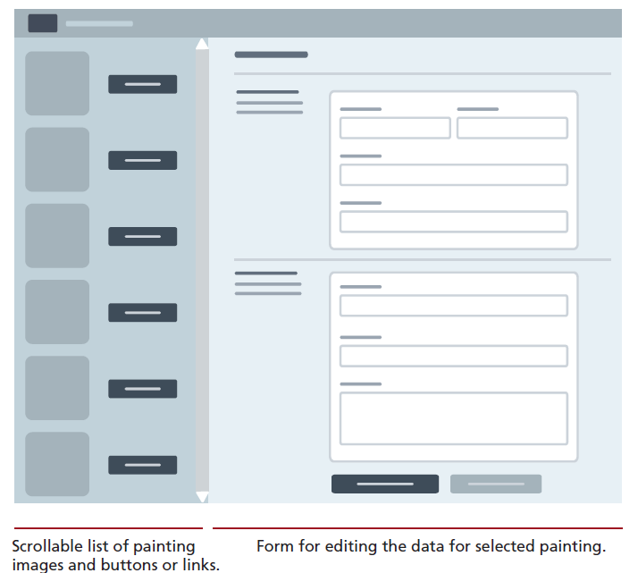

# InclassDatabaseActivity006
This is an in class activity for CSC 350, which covers inserting/updating and deleting content from a NoSQL database.
## Forking this repo (BLAH BLAH BLAH ... the same verbiage as earlier)
To work on this project, you will need to create a personal copy of the repository. This is done by forking it. Follow these steps:
### 1. Fork repository
- Click the “Fork” button located in the upper right corner of the repository page.
- This will create a copy of the repository under your GitHub account. (only one in the project will do this!)
### 2. Clone Your Fork
- On your GitHub account, navigate to your forked repository.
- Clone the forked repository to your local machine.
### 3. Adding Collaborators
- Add your project members in the same way as you would for a normal repository.
- Go to `Settings`, `Collaborators` to add members to this repo.
### 4. New branch
- ***VERY IMPORTANT*** -> Create a new branch before you make any changes to the forked repo!!
- Once the branch is created, make the changes as per project requirements.
- You can make as many commits and as many pushes as needed to that branch that was newly created.
- To be consistent, use the same styling for commit messages that was given in the Project I.
    - [Prefix] – [Short description of the change]
      The following are the only possible options for [Prefix]:
    - FEAT - For new features or major additions to the project.
        - Example: `FEAT - Added contact form to the Contact page`
    - FIX - For bug fixes, corrections, or revisions to the code.
        - Example: `FIX - Corrected navigation bar alignment on mobile devices`
    - STYLE - For stylistic changes such as formatting, CSS modifications, or minor visual updates.
        - Example: `STYLE - Updated color scheme for better contrast`
    - DOCS - For changes or additions to the documentation, including README files and comments in the code.
        - Example: `DOCS - Added project description and setup instructions to README`
    - SECURITY - For changes related to improving the security of the website.
        - Example: `SECURITY - Implemented input validation for contact form`
    - REFACTOR - For code refactoring that doesn’t change functionality but improves code quality or organization.
        - Example: `REFACTOR - Organized CSS files and cleaned up redundant styles`
    - TEST - For adding tests or making changes to the testing suite.
        - Example: `TEST - Added validation tests for contact form input`

### 5. Submitting your work
Once, you are sure that all the work is completed, go through the following steps for submission.
- Go to your forked repository on GitHub.
- Click on the “Pull requests” tab and then the “New pull request” button.
- Select the branch you pushed your changes to.
- Click “Create pull request” and provide a title and description for your changes.
- Submit the pull request.
- If you have made a pull request on error or have made further changes to the branch, you can always close the pull request that was made and make a new pull request.
- The closest pull request to the due date will be reviewed.

### 6. Grading and Feedback
- After the submission deadline, your pull request will be reviewed.
- Feedback and grades will be provided based on the changes made and the quality of the work.

Not sure, how to create a pull request, check this [link](https://docs.github.com/en/pull-requests/collaborating-with-pull-requests/proposing-changes-to-your-work-with-pull-requests/creating-a-pull-request-from-a-fork).

# Project description
This project focuses on integrating database on the server side into a HTML application. The design of the HTML is open-ended with some bare requirements to be met, as mentioned below. Demonstrate your ability to both select and modify data into the database using Node and NoSQL. 

1. Implement a server/client architecture similar to activity 005.
2. You are given a wireframe sketch of the supposed HTML page as seen in the picture below. You are free to implement whatever design you want as the focus here is on functionality. Your page must display a list of
   paintings; when the user selects a painting, it will display a form that allows the
   user to edit the data.

2. If using Node and NoSQL (MongoDB), then create a API that returns an array of all the paintings whenever needed by making a call to the database using the SELECT query.
   Add JavaScript to the HTML file that fetches the results from API and then populates the
   left-side list with an image and a link styled as a button for each painting.
   Add click event handler for each link button, that displays the form on the
   right side each field in the form should be populated with the appropriate
   record data.
3. This table/data has many fields; you should break up the data-entry form into different
   sections to make it easier for the user. The form should have a button
   for saving the current form values and a button for resetting the form. Be sure
   to set the action attribute of the `<form>`. This script will use form data passed to it, and construct
   and execute an UPDATE query (if using SQL) or use the findOneAndUpdate()
   method of the Mongoose model object.
4. Both SQL Tabular format and the NoSQL Json format are provided, it's your preference as to which one you want to go with on the database side.
5. Look up online resources to install SQL or MongoDB onto your machine. JSON file can be made to look prettier - https://jsonformatter.org/json-pretty-print

## Tips and Suggestions
* Start small: Break this problem down into smaller steps. First verify the fetch works,
  perhaps with a simple `console.log` statement. Then populate the `<select>`
  lists based on the fetched data.
* You may decide to move your code into classes within your module after you
  finished your code, or you may decide to work with classes and modules right
  from the start.
* **DON’T USE ABSOLUTE PATHS**. Use only relative paths in your project files. This practice is particularly important when multiple people are working on the same project, as it ensures that links and references work correctly across different environments and systems.
* Iterate and Test: Continuously test your website after making necessary changes.
* Issues: Use the GitHub to create Issues and track the status of the issues using Milestones.
* Focus on Details: Pay attention to small details like spacing, hover effects, to create a polished final product.

